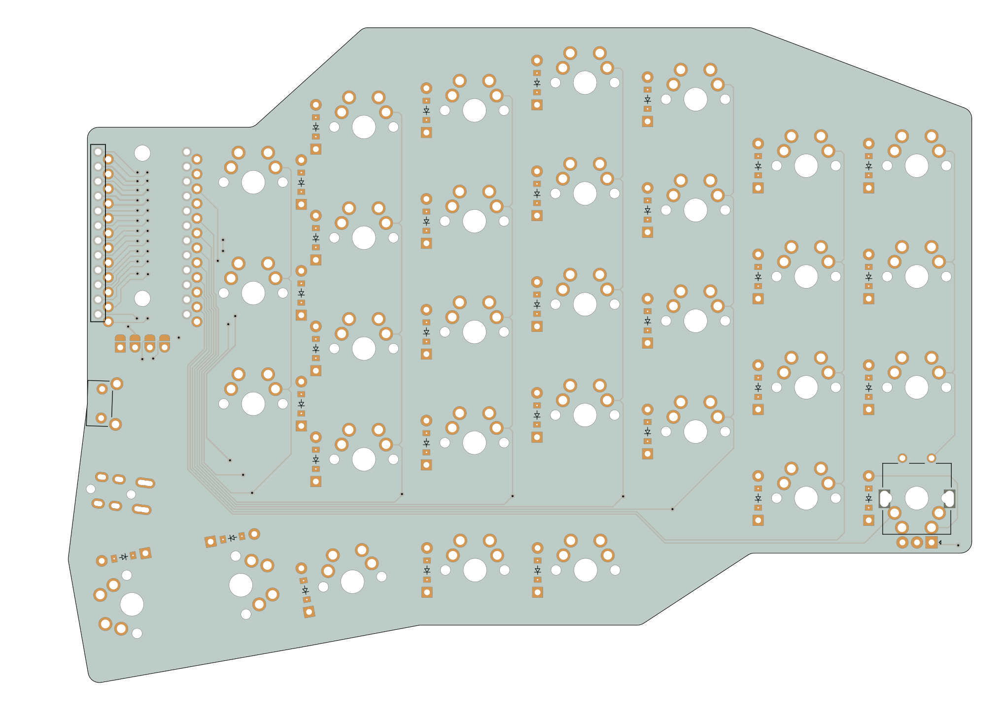

# Spleeb
Another split keyboard... a "Spleeb".

This split keboard is still under development has has not yet been fabricated. It is created using [Ergogen](https://github.com/ergogen/ergogen/) and the routing done manually, copied back into the yaml file. This was inspired a lot by the Ergodash which I used for about a year but wanted something that fit my use and hands a bit better.

### Features

- Reversible PCB
- Optional rotary encoder replacing the bottom left key switch
- OLED screen covering the MCU on the inside of the board
- No acrylic case, only 3D printed case and plate, or cut plate
- No RGB

| Left | Right |
| --- | --- |
|  |  |
