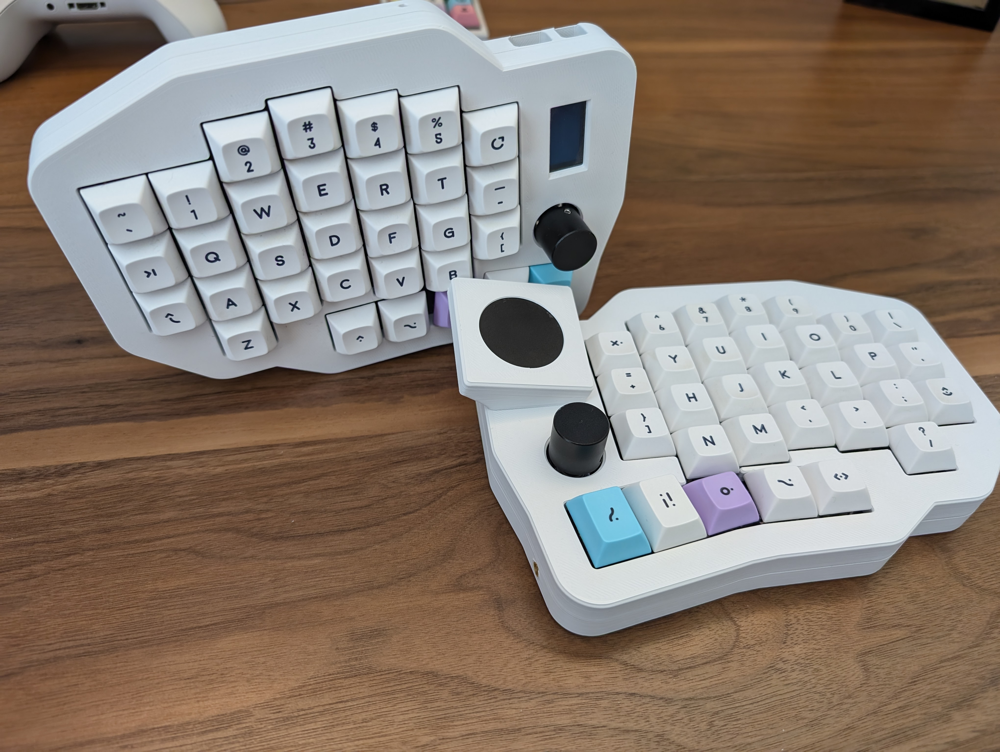
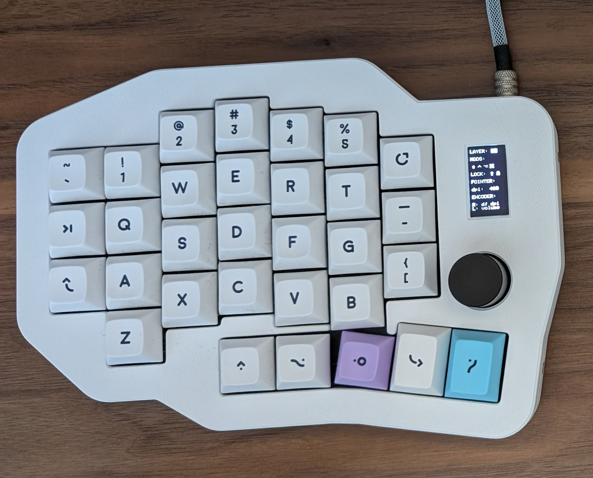
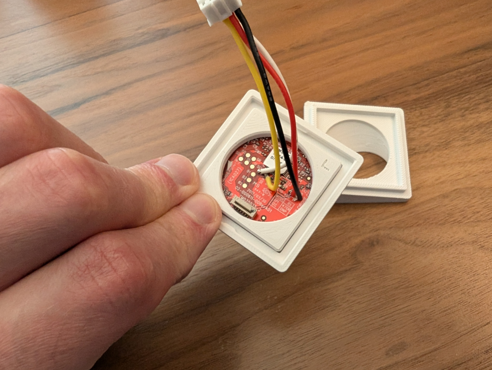

# Spleeb

Another split keyboard... a "Spleeb".

This split keyboard is created using [Ergogen](https://github.com/ergogen/ergogen/) and the routing done manually, copied back into the yaml file. This was inspired a lot by the Ergodash which I used for about a year but wanted something that fit my use and hands a bit better.

## ‼ NOTE ‼

Photos are pictured with heat set inserts in the bottom chassis that **_ARE NOT_** present in the STEP or Fusion 360 files. I was not happy with how the approach I took worked, and didn't want to release something that people may actually use (like the original touchpad bracket which was particularly poorly designed). I didn't want to reprint the bottom just to take some photos. The models in this repo are exactly the same, I just removed the holes for the heat set inserts on the side.

You can read more about the [Spleeb Chassis 1.2 revision in the Pull Request which added it](https://github.com/chrishoage/spleeb/pull/5).

### Features

- Reversible PCB
- Optional rotary encoder replacing the bottom left key switch
- OLED screen covering the MCU on the inside of the board
- No acrylic case, only 3D printed case and plate, or cut plate
- No RGB (a joke - I don't use LEDs on keyboards but am open to accepting PRs if someone wants to do the work)

| Left                                         | Right                                          |
| -------------------------------------------- | ---------------------------------------------- |
|  |  |
|           |           |

### Motivation

I'm not a fan of excessive layers, and many of the popular split keyboards are 3x5 and make heavy use of layers. I used the Ergodash for a while but found the placement of the mods to be uncomfortable, and the top row of the thumb cluster to be unused. Seeing some keyboards (like the [bastard keyboards' dilemma](https://bastardkb.com/dilemma/)) which leveraged the Cirque touchpad inspired me to create my own keyboard which allowed for the layout I wanted, along with all the bells and whistles like rotary encoders, oled screen and touchpad. A secondary purpose of this was to learn Fusion 360, KiCad, and a teensy tiny bit of C and electrical engineering.

### BOM

| Item                                              | Quantity | Notes                                                                                                                                                                    |
| ------------------------------------------------- | -------- | ------------------------------------------------------------------------------------------------------------------------------------------------------------------------ |
| Spleeb PCB                                        | 2        |                                                                                                                                                                          |
| Spleeb Plate                                      | 2        | Intended to be cut from FR4 during PCB fab but this can be 3D printed. Extrude the plate dxf to 1.5mm and it will be 3d printable (fit accuracy depends on your printer) |
| Cirque 35mm Touchpad Flat overlay TM035035        | 1        | i2c only. The SPI version can be modified to use i2c.                                                                                                                    |
| SSD1306 128x64 OLED                               | 1        | DIYmall model and footprint used in chassis model. Other brands may have fit issues with out modification of the model.                                                  |
| Pro Micro pin MCU                                 | 2        | RP2040 recomended. Boardsource Blok used in build                                                                                                                        |
| MX switches                                       | 62       |                                                                                                                                                                          |
| 1u keycaps                                        | 58       |                                                                                                                                                                          |
| 1.25u keycaps                                     | 4        |                                                                                                                                                                          |
| EC11 Encoder                                      | 2        | Alps Alpine EC11N1524402 used in build                                                                                                                                   |
| Encoder Kob                                       | 2        | 18mm diameter                                                                                                                                                            |
| 1N4148 Through Hole Diodes                        | 64       | SMD diodes supported on PCB but this has not been tested                                                                                                                 |
| PJ-320A 3.5 mm jack                               | 2        |                                                                                                                                                                          |
| Alps Alpine SKHLLCA010                            | 2        | Reset Switch                                                                                                                                                             |
| JST PH 2.0 mm 4 pin straight connector            | 2        | These are optional. Wires can be soldered directly to the though hole pads on the PCB. The connectors make disassembly easier.                                           |
| Mill-Max 315-93 Low Profile Sockets               | 48       | These are optional. However the height of regular headers is slightly higher than these, so may need adjusting to the USB cutout                                         |
| Mill-Max 3320 Socket Pins                         | 48       | These are optional. These are for the Mill-Max sockets                                                                                                                   |
| Mill-Max 3305-1 Switch Sockets                    | 124      | These are optional. These allow switches to be swapped with out resoldering                                                                                              |
| M3 M3x5x4 threaded heat set inserts               | 8        | Used to fasten bottom to top of chassis. (Same as the Voron 2.4/Trident BOM)                                                                                             |
| M3 12mm length socket head screws                 | 8        | Used to fasten bottom to top of chassis. 10mm _should_ work as well.                                                                                                     |
| M2 4mm installed length threaded heat set inserts | 10       | Used to fasten plate to top and Cirque bracket to top. Up to 20 may be used depending on how much stiffness in the plate is desired.                                     |
| M2 8mm length ultra low profile screws            | 8        | Used to attach plate to top. Minimum 8. Up to 20 may be used depending on how many M2 heat set inserts are installed top top.                                            |
| Silicone O-Rings, 4mm OD 1mm ID 1.5mm Width       | 16       | Used for a poor man's burger mount isolation for the plate and top                                                                                                       |
| M2 4mm length ultra low profile screws            | 6        | 2-4 for the oled, 2 for the angled Ciruqe bracket                                                                                                                        |
| Hookup Wire                                       | x        | Needed for OLED and Cirque Touchpad                                                                                                                                      |

### Build Notes (Spleeb Chassis rev 1.2)

Most of this build is straight forward and would follow any PCB build. Look for the diode silkscreen to know which direction didoes should go.

The original chassis CAD files created using Fusion 360 [are included](./chassis/) and the step files for all parts included as well.

There are [more photos](/images/) not shown in the readme in th images directory.

#### "Burger" Mount

Two silicone O-rings are to be placed in-between the plate and the contact points. One under the screw head and one under the plate. The plate is then screwed into the "top" of the chassis for a top mount approach.

The original plate had 10 attachment points for the "sandwich" mount chassis that was designed before this current iteration. In hindsight this was far too many. While the design and 3d models still support all 10 attachment points, only 4 need to be used.

I am currently using the two on each side of the plate and it feels just fine and there is no rattle. Tightening down the screws all the way is not necessary, just enough so that the plate doesn't move.

|                                                                        |                                                                                           |
| ---------------------------------------------------------------------- | ----------------------------------------------------------------------------------------- |
|  |  |

#### MCU Mounting and MCU Solder pads

This PCB has solder pads on each side of the PCB. These solder pads allow the MCU to be mounted on either side of the PCB - however the intended use for this build is mounting the MCUs on the _underside_ of the PCB - the side opposite the switches, with the MCU LED facing up. With this orientation the solder pads should be solder on the \*same side as the switches.

The solder pad opposite the through hole pad marked with the square 🔳 is RAW.

If you mount the MCU with the LED facing out on the top (same side as switches) you would solder the pads on the top.

If you mount the MCU with the LED facing out on the bottom (opposite side of switches) you would solder the pads on the bottom.

If you mount the MCU with the LED facing in on the top (same side as switches) you would solder the pads on the bottom.

If you mount the MCU with the LED facing in on the bottom (opposite side of switches) you would solder the pads on the top.

Again - with the chassis as designed the last mounting option is the only one supported:

Mount the MCU on the opposite side of the switches, with the LED facing in. Solder the pads on the same side as the switches.

| MCU Orientation                                                            | Solder pads on top                                                                        |
| -------------------------------------------------------------------------- | ----------------------------------------------------------------------------------------- |
|  |  |

Since the PCB is reversible you would mirror this on the other side.

#### Cirque 35mm Touchpad

Use hookup wire to solder to the GND, VCC, SDA, SCL pads, and remove the R1 resistor if the SPI version was purchased.

#### JST PH 2.0 connector

Wires should be hooked up to connector from the "outside" edge of the pcb to "inside" (PCB is reversible)

1. SCL ("outside" - white)
1. SDA (yellow)
1. VCC (red)
1. GND ("inside" - black)

#### Cirque Touchpad Bracket

The bracket is split into three parts.

- _Support_: 35mm Cirque touchpad sits in the support. The support has indexing features to hold the touchpad in the correct orientation. The "L" embossed in the support is a rudimentary X/Y plane to remember orientation.
- _Bezel_: The Support snaps into place inside the bezel.
- _Bracket_: The Support + Bezel assembly snaps on top of the bracket which holds the assembly at a 15° angle.

|                                                                                      |                                                                                  |
| ------------------------------------------------------------------------------------ | -------------------------------------------------------------------------------- |
|       |                 |
|           |  |
|  |                  |

#### OLED attachment

The intent is that the 4mm ultra low profile screws should fasten directly into the plastic.

### Printing

I used ASA but anything should work depending on your printer. I didn't use supports for the 3.5mm and USB cutouts. YMMV on needing supports, but I designed the model to be printed with out supports.

#### Critical print parameters

There are features in this model which demand a 0.4 nozzle and 0.2mm layer hight. All other printing parameters are to taste.

### Firmware

Firmware is QMK based and [can be found in the QMK GitHub repo](https://github.com/qmk/qmk_firmware/tree/master/keyboards/spleeb).

My personal keymap customizations [can be found my my QMK Userspace Fork](https://github.com/chrishoage/qmk_userspace/tree/main/keyboards/spleeb/keymaps/chrishoage)

## License

- All code in this repository is licensed under the [MIT](./LICENSE) license.
- All images in this repository are licensed under the [Creative Commons Attribution-NonCommercial](https://creativecommons.org/licenses/by-nc/4.0/) license.
- All CAD files in this repository are licensed under the [Creative Commons Attribution-NonCommercial-ShareAlike](https://creativecommons.org/licenses/by-nc-sa/4.0/) license.
